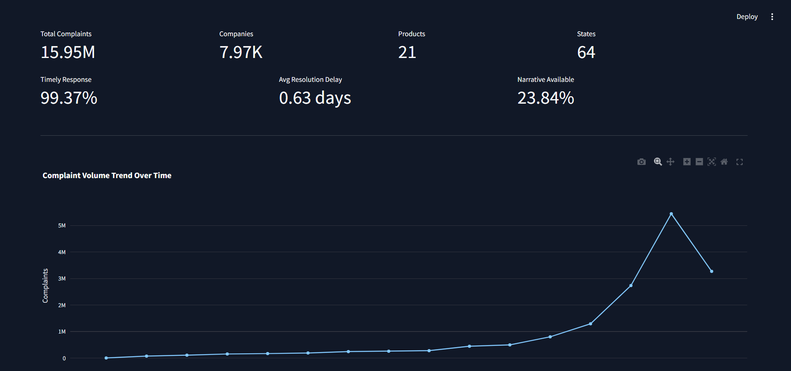
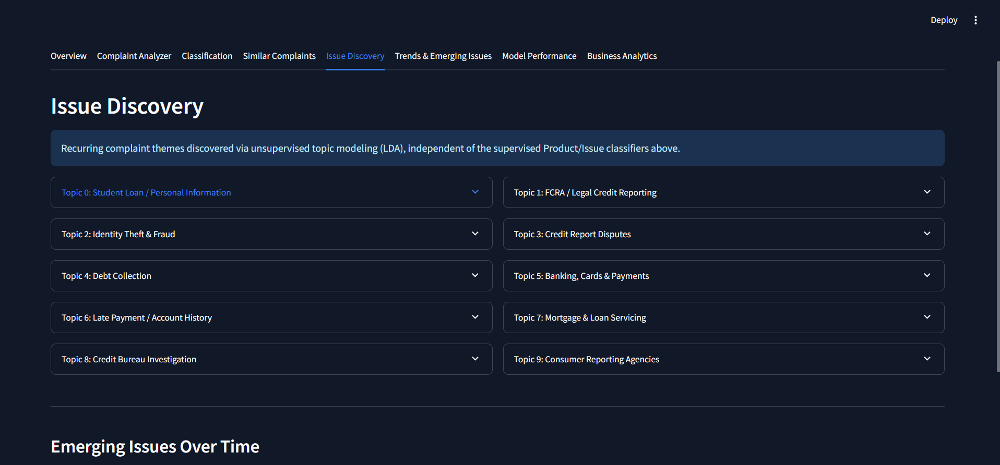
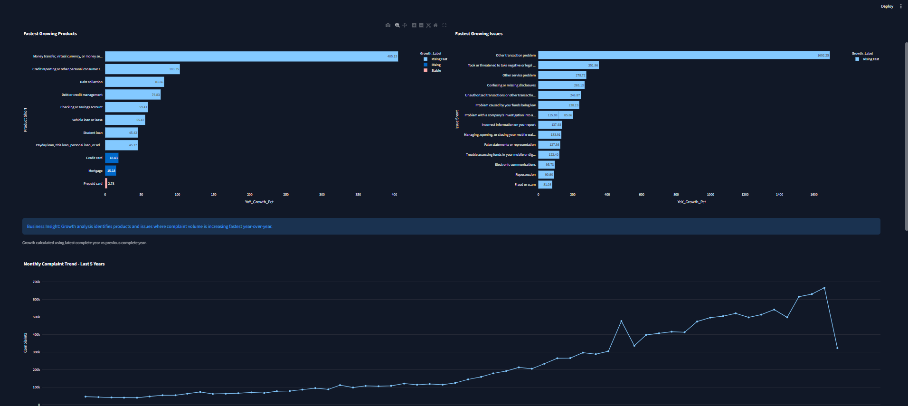
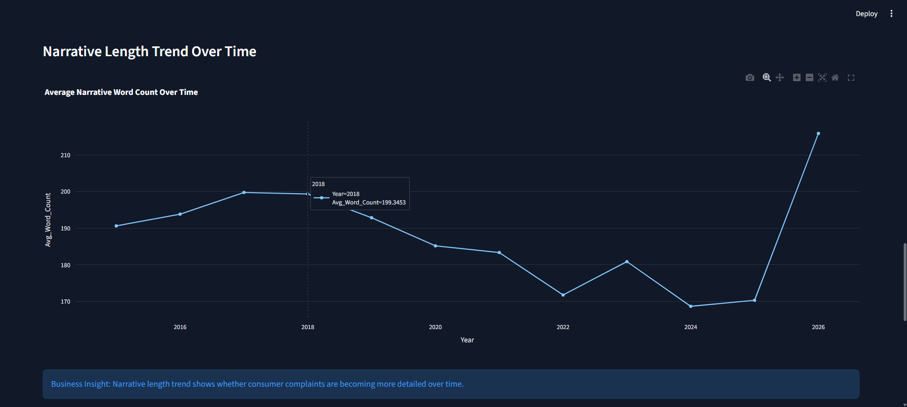
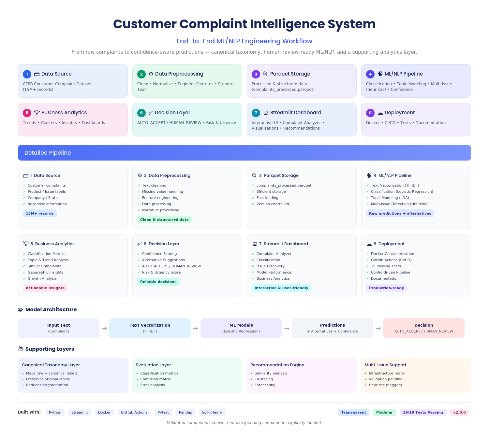
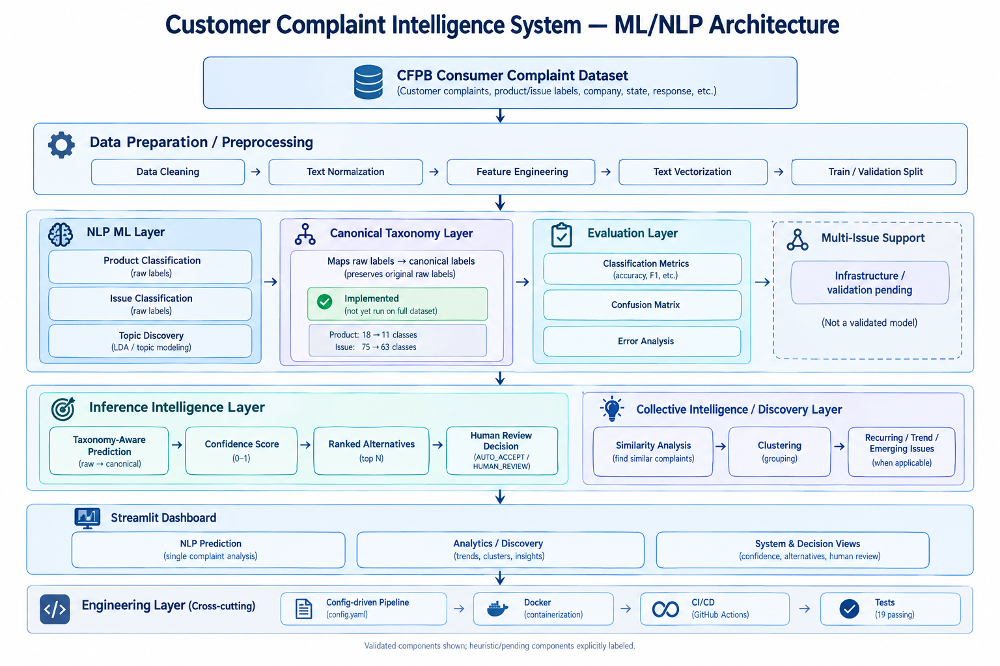

# Machine Learning / NLP Customer Complaint Intelligence System


**Version:** v2.0.0 · **Status:** Production-Style Portfolio Project

An ML/NLP system built on the CFPB Consumer Complaint dataset (**15.95M
complaints**, **8-9 GB raw CSV**) that classifies complaint narratives
into Product/Issue categories, discovers recurring and emerging
complaint themes through unsupervised topic modeling, and surfaces
low-confidence predictions for human review — with a canonical
taxonomy layer that fixes label fragmentation caused by CFPB's
historical schema changes (see
[`docs/taxonomy_audit.md`](docs/taxonomy_audit.md)).

```
                ML / NLP
                   |
        +----------+----------+
        v                     v
Complaint Intelligence   Issue Discovery
        |
        v
Business Intelligence
        |
        +-- Risk
        +-- Trends
        +-- Forecasting
        +-- Recommendations
```

The executive analytics, company risk scoring, growth detection,
forecasting, and prescriptive recommendations that shipped with the
original version of this project are still fully present — they now
serve as the Business Analytics layer supporting the ML/NLP core,
rather than being the project's headline identity. Nothing about them
was removed or changed; see the "Business Analytics" tab.

This is a portfolio project built with production-style engineering practices: modular pipelines, config-driven design, defensive error handling, structured logging, automated tests, GitHub Actions, Docker deployment, and detailed technical documentation.

---

## Links

* **GitHub Repository:** [github.com/<your-github-username>/customer-complaint-intelligence](https://github.com/<your-github-username>/customer-complaint-intelligence)
* **Docker Hub:** [hub.docker.com/repository/docker/<your-dockerhub-username>/customer-complaint-intelligence](https://hub.docker.com/repository/docker/<your-dockerhub-username>/customer-complaint-intelligence)
* **Project Summary:** [PROJECT_SUMMARY.md](PROJECT_SUMMARY.md)
* **Interview Q&A:** [docs/INTERVIEW_QA.md](docs/INTERVIEW_QA.md)
* **Taxonomy Audit:** [docs/taxonomy_audit.md](docs/taxonomy_audit.md)
* **Multi-Issue Plan:** [docs/multi_issue_plan.md](docs/multi_issue_plan.md)

---

## Dashboard Preview










Additional screenshots are available in [`assets/screenshots/`](assets/screenshots/).

---

## Project Workflow



---

## Architecture Diagram



Full architecture breakdown: [`docs/architecture.md`](docs/architecture.md)

---

## Quick Snapshot

| Area                        | Result                                        |
| --------------------------- | --------------------------------------------- |
| Dataset                     | 15.95M complaints                             |
| Raw data size               | 8-9 GB CSV                                    |
| Processed storage           | Parquet-based pipeline outputs                |
| Companies                   | 7.97K                                         |
| Products                    | 21                                            |
| Product classifier accuracy | 75.28% (raw labels; not yet retrained on canonical taxonomy) |
| Issue classifier accuracy   | 62.39% (raw labels; not yet retrained on canonical taxonomy) |
| Product taxonomy            | 18 raw labels → 11 canonical categories       |
| Issue taxonomy              | 75 raw labels → 63 canonical categories       |
| Forecast validation MAPE    | 3.57%                                         |
| Forecast validation MAE     | 17,748                                        |
| Unit tests                  | 19/19 passing                                 |
| Deployment                  | Dockerized + Docker Hub                       |
| CI/CD                       | GitHub Actions test + Docker build validation |

Full evaluation details: [`docs/evaluation.md`](docs/evaluation.md)
Taxonomy audit details: [`docs/taxonomy_audit.md`](docs/taxonomy_audit.md)

---

## CI/CD

GitHub Actions validates the project automatically on push.

```text
Push to GitHub
      ↓
Run Unit Tests
      ↓
Validate Docker Build
      ↓
Block broken changes
```

The workflow helps ensure that core tests and Docker image builds remain stable before changes reach the main branch.

---

## Problem Statement

Financial complaint datasets are difficult to use directly because they are large, messy, and operationally complex. A dashboard that only shows charts is not enough; decision-makers need risk signals, growth patterns, forecasts, and recommended actions.

This project solves two problems:

1. **Scale** — process millions of rows efficiently using chunked ingestion, Parquet storage, column pruning, and pre-aggregated dashboard outputs.
2. **Actionability** — convert complaint trends, company risk, forecasting, and NLP signals into executive recommendations.

---

## Dataset

| Property               | Value                                                                                                  |
| ---------------------- | ------------------------------------------------------------------------------------------------------ |
| Source                 | [CFPB Consumer Complaint Database](https://www.consumerfinance.gov/data-research/consumer-complaints/) |
| Total complaints       | 15.95M                                                                                                 |
| Raw CSV size           | 8-9 GB                                                                                                 |
| Narrative availability | ~3.8M complaints / 23.84%                                                                              |
| Companies              | 7.97K                                                                                                  |
| Products               | 21                                                                                                     |
| States / territories   | 64                                                                                                     |

Complaint volume should be interpreted carefully. A high count for a large company or populous state does not automatically mean a higher complaint rate per customer or resident.

---

## What It Does

### ML / NLP Core

The system's identity: classify, discover, and flag for review — not
just predict a single label.

```
Complaint
    |
Text Preprocessing
    |
Canonical Taxonomy         <- fixes CFPB label fragmentation, see docs/taxonomy_audit.md
    |
Feature Engineering (TF-IDF)
    |
Product Classifier   ----> Issue Classifier
    |                           |
    +------------+--------------+
                 |
        Confidence / Top-K
                 |
       Abstention / Human Review   <- AUTO_ACCEPT vs HUMAN_REVIEW
                 |
      Final Complaint Intelligence
```

* **Canonical taxonomy layer** (`src/taxonomy.py`, `src/taxonomy_audit.py`) — collapses CFPB Product/Issue labels that were only fragmented by historical taxonomy renames (18 → 11 Product classes, 75 → 63 Issue classes), while always preserving the original raw label.
* **Product & Issue classification** (TF-IDF + Logistic Regression) with taxonomy-aware **confidence scoring, top alternatives, and an AUTO_ACCEPT / HUMAN_REVIEW decision** (`src/nlp_predictor.py`) — low-confidence predictions are flagged instead of silently presented as certain.
* **Multi-issue infrastructure** (`src/multi_issue.py`) — a heuristic, clearly-flagged-as-unvalidated extension for complaints that plausibly describe more than one issue, plus a documented scientific plan (`docs/multi_issue_plan.md`) for validating and training a real multi-label model once raw narrative data with ground truth is available.
* **Topic Discovery Layer** (`src/topic_discovery.py`) — elevates LDA topic modeling from a per-complaint side-feature into unsupervised discovery of recurring complaint themes, clusters, and (once a timestamped narrative corpus is available) emerging issues over time.
* **Rigorous evaluation** (`src/nlp_evaluation.py`) — Macro F1, Weighted F1, Top-K accuracy, and automatic plain-language error analysis of *which* categories the model confuses and *why*, instead of a single accuracy number.

Models used:

```text
TF-IDF + Logistic Regression   (Product / Issue classification)
LDA Topic Modeling             (unsupervised discovery)
```

### Business Analytics (Supporting Layer)

Everything below still exists exactly as before and is fully
functional — it now sits underneath the ML/NLP core as the "Business
Analytics" tab, feeding on the same classified/discovered complaint
intelligence rather than being the project's headline identity.

**Executive Analytics**

* Executive KPI dashboard
* Product analysis
* Issue analysis
* Company analysis
* Resolution analysis
* Geography analysis
* Consumer segment analysis
* Narrative intelligence

The Streamlit app reads pre-aggregated Parquet summaries instead of loading the full 15.95M-row dataset at runtime.

**Advanced Intelligence**

* **Company Risk Score** using complaint volume, untimely response rate, and average resolution delay
* **Driver Analysis** using Product → Issue → Sub-issue combinations
* **Growth Analysis** with labels such as Stable, Rising, Rising Fast, Declining, and New / Emerging
* **Forecasting** using Prophet with six-month holdout validation

**Recommendation Engine**

The recommendation engine converts analytical signals into an executive action plan.

Inputs:

* Company risk scores
* Product growth
* Issue growth
* Forecast trends
* Complaint drivers

Outputs:

* Prioritized recommendations
* Executive action plan
* Risk and growth based operational guidance

---

## Key Results

| Metric                      | Value         |
| --------------------------- | ------------- |
| Timely response rate        | 99.37%        |
| Average resolution delay    | 0.63 days     |
| Narrative availability      | 23.84%        |
| Product classifier accuracy | 75.28%        |
| Issue classifier accuracy   | 62.39%        |
| Forecast validation MAPE    | 3.57%         |
| Forecast validation MAE     | 17,748        |
| Unit tests                  | 19/19 passing |

These metrics are documented with limitations in [`docs/evaluation.md`](docs/evaluation.md).

---

## Architecture

```text
CFPB Raw Data
15.95M rows / 8-9 GB CSV
        ↓
Chunked Preprocessing
Validation + Cleaning + Feature Engineering
        ↓
Processed Parquet Data
        ↓
        ├──► Canonical Taxonomy ──► NLP Classification ──► Confidence / Human Review
        ├──► Topic Modeling ──► Issue Discovery Layer
        └──► Dashboard Aggregation
                    ↓
        Risk Analysis ─ Growth Analysis ─ Driver Analysis ─ Forecasting
                    ↓
            Recommendation Engine
                    ↓
            Streamlit Dashboard
                    ↓
            Docker Deployment
```

NLP training is intentionally separated from the main analytics pipeline because training over hundreds of thousands of narratives is computationally expensive and should not run on every dashboard refresh. Full breakdown: [`docs/architecture.md`](docs/architecture.md).

---

## Engineering Decisions

| Decision                       | Reason                                                                              |
| ------------------------------ | ----------------------------------------------------------------------------------- |
| Canonical taxonomy layer       | Fixes CFPB label fragmentation before training/inference (see `docs/taxonomy_audit.md`) |
| Confidence + human review      | Surfaces low-confidence predictions instead of presenting every label as certain    |
| Parquet over CSV               | Smaller storage footprint and faster column-based reads                             |
| Pre-aggregated dashboard files | Keeps Streamlit fast and memory-light                                               |
| TF-IDF + Logistic Regression   | Strong CPU-friendly baseline with fast inference                                    |
| No sentiment analysis          | Complaint narratives are structurally negative, so generic sentiment adds low value |
| Prophet forecasting            | Suitable for monthly trend and seasonality forecasting                              |
| Config-driven design           | Thresholds and paths live in `config.yaml`, not hardcoded code                      |
| Docker deployment              | One-command reproducible application startup                                        |
| GitHub Actions                 | Automated tests and Docker build validation                                         |

---

## Why Not Deep Learning?

A transformer-based model could be used, but this project prioritizes CPU-only deployment, reproducibility, faster inference, and lower operational cost. TF-IDF + Logistic Regression achieved practical performance while keeping the system deployable on consumer-grade hardware.

Current NLP performance:

```text
Product Classifier Accuracy: 75.28%
Issue Classifier Accuracy:   62.39%
```

---

## Business Insights

The platform is designed to surface decision-oriented insights:

* Complaint handling is largely timely, with a 99.37% timely response rate.
* Narrative availability is limited to 23.84%, so NLP applies only to complaints with consumer narrative text.
* Complaint volume is concentrated across a smaller number of products and companies.
* Growth signals help detect emerging operational risk before total volume becomes large.
* Forecasting converts historical complaint trends into planning inputs.
* Recommendations help move from descriptive analytics to action.

These insights are derived from the processed CFPB complaint data and should be used for analytical decision support, not legal or regulatory conclusions.

---

## Project Structure

```text
customer-complaint-intelligence/
├── app/                  Streamlit dashboard
├── src/                  Core pipeline modules
├── docs/                 Technical documentation
│   └── INTERVIEW_QA.md   Interview preparation notes
├── notebooks/            Exploratory analysis (EDA, NLP) notebooks
├── data/processed/       Dashboard-ready Parquet outputs
├── models/nlp/           Trained NLP artifacts
├── tests/                Unit tests
├── assets/               Screenshots and architecture images
├── .github/workflows/    GitHub Actions workflows
├── .streamlit/           Streamlit theme configuration
├── config.yaml           Central configuration
├── PROJECT_SUMMARY.md    Short recruiter/interviewer overview
├── Dockerfile
├── requirements.txt
├── pyproject.toml
├── uv.lock               Locked dependency versions (uv package manager)
├── CHANGELOG.md
└── LICENSE
```

---

## Setup & Usage

### 1. Create Environment

```bash
python -m venv venv
source venv/bin/activate
```

Windows:

```bash
venv\Scripts\activate
```

Install dependencies:

```bash
pip install -r requirements.txt
```

### 2. Add Raw Data

Download the CFPB complaint dataset and place it at:

```text
data/raw/complaints.csv
```

or update the path in `config.yaml`.

### 3. Run Preprocessing

```bash
python -m src.preprocessing
```

### 4. Run Analytics Pipeline

```bash
python -m src.pipeline
```

### 5. Run Dashboard

```bash
streamlit run app/streamlit_app.py
```

### 6. Run Tests

```bash
python -m pytest tests -v
```

---

## Docker

Build locally:

```bash
docker build -t customer-complaint-intelligence:v1 .
```

Run locally:

```bash
docker run -p 8501:8501 customer-complaint-intelligence:v1
```

Pull from Docker Hub:

```bash
docker pull <your-dockerhub-username>/customer-complaint-intelligence:latest
docker run -p 8501:8501 <your-dockerhub-username>/customer-complaint-intelligence:latest
```

Full guide: [`docs/docker.md`](docs/docker.md)

---

## Reproducibility

* Fixed `random_state`
* Config-driven parameters
* Separated training and inference artifacts
* Dockerized runtime
* GitHub Actions validation
* Documented evaluation and limitations

---

## Known Limitations

* Geographic complaint counts are not normalized by population.
* The currently-shipped Product/Issue models are trained on **raw** CFPB labels; the canonical-taxonomy training path exists (`src/nlp_model_training.py`) but hasn't been exercised on real data yet — retraining requires the raw narrative dataset, which isn't bundled with this repository (see [`docs/taxonomy_audit.md`](docs/taxonomy_audit.md)).
* Multi-issue detection (`src/multi_issue.py`) is an explicitly-flagged heuristic on top of the existing single-label classifier, not a validated multi-label model — see [`docs/multi_issue_plan.md`](docs/multi_issue_plan.md) for the plan to build and validate a real one.
* "Similar Complaints" search and the time-based "emerging issues" view are fully implemented but need a narrative-text corpus (`data/processed/narratives_training.parquet`) to run against; the dashboard shows a clear message instead of fabricated results when it's absent.
* NLP confidence scores are taxonomy-aware but not formally calibrated (e.g. via Platt scaling).
* Forecasting uses complaint volume only and does not include external economic or regulatory signals.
* Topic modeling uses LDA with manually interpreted topic names.

---

## Future Enhancements

* Retrain Product/Issue classifiers on the canonical taxonomy against real data, to get measured Macro F1 / Weighted F1 / Top-K numbers
* Validate multi-issue detection against real narrative data and, if warranted, train a real multi-label model (see [`docs/multi_issue_plan.md`](docs/multi_issue_plan.md))
* Populate the narrative corpus needed for Similar Complaints search and time-based emerging-issue detection
* Formally calibrate confidence scores (e.g. Platt scaling / isotonic regression)
* Per-capita geographic normalization
* Model metadata and versioning
* Runtime and memory benchmarks
* FastAPI serving layer
* Model drift monitoring
* Full config reference documentation

---

## Documentation Index

| File                                                 | Purpose                                 |
| ---------------------------------------------------- | --------------------------------------- |
| [`PROJECT_SUMMARY.md`](PROJECT_SUMMARY.md)           | Short recruiter/interviewer overview    |
| [`docs/INTERVIEW_QA.md`](docs/INTERVIEW_QA.md)       | Interview preparation questions and answers |
| [`docs/architecture.md`](docs/architecture.md)       | System architecture and module flow     |
| [`docs/evaluation.md`](docs/evaluation.md)           | Model metrics and validation details    |
| [`docs/taxonomy_audit.md`](docs/taxonomy_audit.md)   | CFPB label taxonomy audit (canonical mapping) |
| [`docs/multi_issue_plan.md`](docs/multi_issue_plan.md) | Multi-issue detection: current heuristic and validation plan |
| [`docs/case_study.md`](docs/case_study.md)           | Engineering case study and tradeoffs    |
| [`docs/docker.md`](docs/docker.md)                   | Docker build and deployment guide       |
| [`docs/data_dictionary.md`](docs/data_dictionary.md) | Dataset columns and engineered features |
| [`docs/runbook.md`](docs/runbook.md)                 | Operational commands                    |
| [`docs/benchmark.md`](docs/benchmark.md)             | Performance and benchmark notes         |
| [`docs/adr.md`](docs/adr.md)                         | Architecture decision records           |
| [`CHANGELOG.md`](CHANGELOG.md)                       | Version history                         |
| [`LICENSE`](LICENSE)                                 | MIT License                             |

---

## Author

**Snaa Alnaggar** — Author

---

## License

MIT License — see [`LICENSE`](LICENSE).
